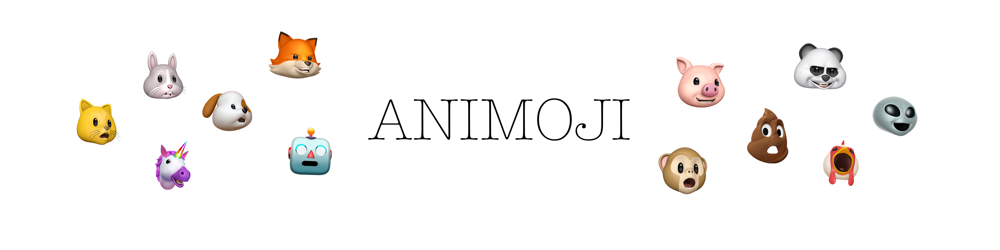

<p align="center">

</p>

<p align="center">
<a href="https://swift.org" target="_blank">

</a>
<a href="http://cocoapods.org/pods/Animoji" target="_blank">

</a>
<a href="http://cocoapods.org/pods/Animoji" target="_blank">

</a>
<a href="http://cocoapods.org/pods/Animoji" target="_blank">

</a>
<a href="https://github.com/Carthage/Carthage" target="_blank">

</a>
</p>

**Animoji** is an iOS library that gives access to the private framework AvatarKit to generate Animoji, just like the Messages app.

*Supports 11.3 Animoji (lion, dragon, skull, bear)!*

*Support for recording coming soon!*

*100% Swift version coming soon!*

**Animoji uses iPhone X and iOS 11.1 features so no Simulator support yet.**


[Demo Video](https://gfycat.com/gifs/detail/FlawlessCleverBluejay)

```
$ pod try Animoji
```

## Requirements

- iOS 11.1+
- Xcode 9.1+
- Swift 4

## Usage

You can initialize an _Animoji_ like a UIView. _Animoji_ is a `SCNView` so if your using a storyboard/xib use a SceneKit View.

```swift
import Animoji

let animoji = Animoji(frame: self.view.bounds)
animoji.setPuppet(name: .cat)
view.addSubview(animoji)
```

#### iOS 11.3 Support

```swift
import Animoji

let animoji = Animoji(frame: self.view.bounds)
// set iOS 11.3 puppet (lion, dragon, skull, bear)
animoji.setPuppet(name: "dragon")
view.addSubview(animoji)
```

## Installation

Animoji is available via CocoaPods and Carthage.

### CocoaPods
To install with [CocoaPods](http://cocoapods.org/), simply add this in your `Podfile`:
```ruby
use_frameworks!
pod "Animoji"
```

### Carthage
To install with [Carthage](https://github.com/Carthage/Carthage), simply add this in your `Cartfile`:
```ruby
github "efremidze/Animoji"
```

## Privacy Settings

You must provide a description for how your app uses the following privacy settings in your app's Info.plist file.

* NSPhotoLibraryAddUsageDescription
* NSMicrophoneUsageDescription
* NSCameraUsageDescription

## Disclaimer

Animoji utilizes Apple's private API to do its magic. Use caution, submitting this code to the App Store adds the risk of being rejected!

## Communication

- If you **found a bug**, open an issue.
- If you **have a feature request**, open an issue.
- If you **want to contribute**, submit a pull request.

## Apps Using _Animoji_

Feel free to submit a PR if you’re using this library in your apps.

## License

Animoji is available under the MIT license. See the LICENSE file for more info.
